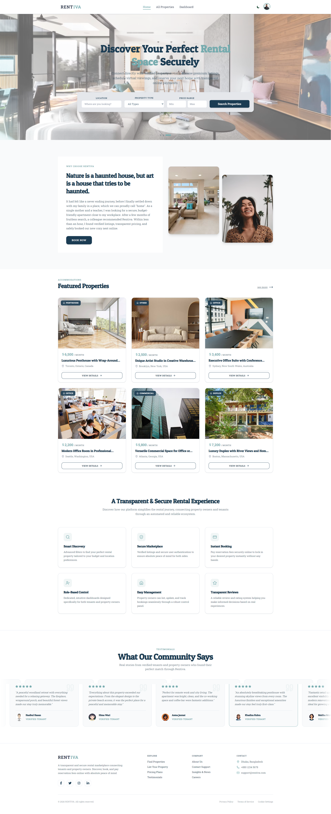
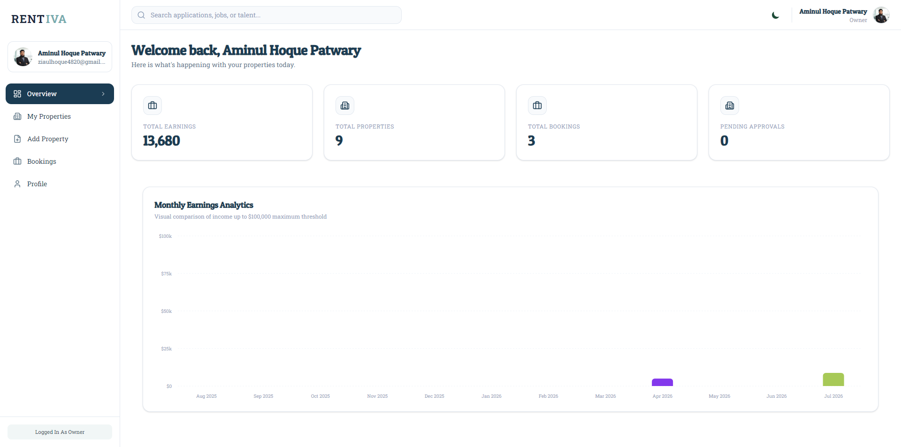

# 🏠 Rentiva – Property Rental & Booking Platform

A modern, full-stack web application that connects property owners and tenants through a transparent and secure rental marketplace. Built with industry-standard technologies and designed with scalability and user experience in mind.

---

## 🔗 Live Links & Repositories

### **Live Demo**
- **Frontend:** [https://rentiva-nu.vercel.app](https://rentiva-nu.vercel.app)
- **Backend API:** [https://rentiva-server.onrender.com](https://rentiva-server.onrender.com)

### **GitHub Repositories**
- **Client (Frontend):** [Rentiva-client](https://github.com/ziaulhoquepatwary/Rentiva-client.git)
- **Server (Backend):** [Rentiva-server](https://github.com/ziaulhoquepatwary/Rentiva-server.git)

---

## 📖 Project Overview

**Rentiva** is a comprehensive property rental platform designed to simplify the rental process for both property owners and tenants. The platform provides:

- **For Tenants:** Seamless property discovery, secure booking, and online payment
- **For Owners:** Complete property management, booking oversight, and tenant communication
- **For Admins:** Moderation tools, activity monitoring, and platform control

The application is built with a modern tech stack featuring **Next.js 16**, **React 19**, and a robust **Node.js/Express** backend, ensuring performance, security, and maintainability.

---

## 📸 Screenshots

### **Homepage**


### **Dashboard - Tenant View**


---

## ✨ Key Features

### 1. **Property Discovery & Search**
- Advanced search with location, property type, and price range filters
- Responsive property listing page with pagination
- Featured properties on the landing page
- Quick sorting options (price, rating, newest)

### 2. **User Authentication & Role Management**
- Secure authentication powered by **Better Auth**
- Three distinct user roles: Tenant, Owner, Admin
- Role-based route protection and navigation
- Guided onboarding flow for new users

### 3. **Property Management (Owner Dashboard)**
- Create, edit, and delete rental properties
- Property status tracking (pending, approved, active)
- Image management with cloud integration
- Property analytics and booking overview

### 4. **Secure Payment Integration**
- Stripe payment gateway for secure transactions
- Checkout session management
- Payment confirmation and receipts
- Booking confirmation after successful payment

### 5. **Booking & Reservation System**
- Property detail pages with booking form
- Date selection and availability checking
- Booking history and cancellation options
- Real-time booking status updates

### 6. **Reviews & Ratings**
- Tenant reviews for properties
- Property rating system
- Review moderation and display
- User feedback collection

### 7. **Personalization**
- Save favorite properties
- Personalized user dashboard
- Booking history tracking
- Preference-based recommendations

### 8. **Admin Control Panel**
- Dashboard for reviewing pending properties
- User management and activity monitoring
- Platform analytics and statistics
- Property approval workflow

---

## 🛠️ Tech Stack

### **Frontend**
| Technology | Purpose |
|---|---|
| **Next.js 16** | Server-side rendering, API routes, and optimized performance |
| **React 19** | Dynamic UI components and state management |
| **Tailwind CSS** | Modern, responsive styling |
| **Framer Motion** | Smooth animations and transitions |
| **Recharts** | Data visualization for analytics |
| **Better Auth** | Authentication and session management |
| **Stripe.js** | Payment processing integration |
| **Axios** | HTTP client for API requests |

### **Backend**
| Technology | Purpose |
|---|---|
| **Node.js** | Runtime environment |
| **Express.js** | RESTful API framework |
| **MongoDB** | NoSQL database |
| **Mongoose** | MongoDB object modeling |
| **Zod** | Schema validation and type checking |
| **Stripe API** | Payment processing |

---

## Project Structure

The project is organized in a clean and scalable folder structure so the frontend, shared UI, and app logic stay separated.

```text
src/
  app/                  # Next.js App Router pages, layouts, and route groups
    (main)/             # public-facing pages like home, properties, details
    (dashboard)/        # tenant, owner, and admin dashboard pages
    (auth)/             # login and registration pages
    api/                # API routes such as Stripe checkout

  components/           # reusable UI components such as navbar, cards, search, modal
  context/              # global context providers like theme handling
  lib/                  # API action helpers, auth client, Stripe integration
  utils/                # shared utilities such as protected route logic

public/                # static assets like images and icons
```
---

## 🚀 Getting Started

### **Prerequisites**
- Node.js 18+ and npm/pnpm
- MongoDB instance (local or cloud)
- Stripe account for payment integration

### **Installation - Frontend**

1. **Clone the repository**
   ```bash
   git clone https://github.com/ziaulhoquepatwary/Rentiva-client.git
   cd rentiva-client
   ```

2. **Install dependencies**
   ```bash
   npm install
   ```

3. **Configure environment variables**
   
   Create a `.env.local` file in the root directory:
   ```env
   NEXT_PUBLIC_BACKEND_URL=http://localhost:5000
   NEXT_PUBLIC_STRIPE_PUBLIC_KEY=your_stripe_public_key
   STRIPE_SECRET_KEY=your_stripe_secret_key
   ```

4. **Run development server**
   ```bash
   npm run dev
   ```

5. **Access the application**
   ```
   http://localhost:3000
   ```

---

## 🎨 Core Functionalities

### **1. Property Discovery Experience**
- **Search & Filter:** Users can filter properties by location, type, price range, and amenities
- **Pagination:** Efficient property listing with page-based navigation
- **Sorting:** Sort by price (low-high, high-low), rating, and newest listings
- **Featured Section:** Highlighted properties on the landing page

### **2. Authentication & Authorization**
- **Better Auth Integration:** Secure session management
- **Role-Based Access Control:** Tenant, Owner, and Admin routes protected
- **Protected Routes:** Middleware prevents unauthorized access
- **User Onboarding:** Role selection flow for new users

### **3. Property Management Dashboard**
- **CRUD Operations:** Create, read, update, delete properties
- **Status Tracking:** Pending → Approved → Active workflow
- **Image Management:** Upload and manage property images
- **Analytics:** Booking count, revenue, and occupancy insights

### **4. Booking & Payment System**
- **Date Selection:** Calendar-based availability checking
- **Stripe Integration:** Secure payment processing
- **Payment Confirmation:** Automated email and receipt generation
- **Booking Management:** Cancel, modify, and view booking history

### **5. Review & Rating System**
- **Property Reviews:** Tenants can submit detailed reviews
- **Star Ratings:** 1-5 star rating system
- **Review Moderation:** Admin approval for transparency
- **Rating Display:** Average ratings on property cards

### **6. Admin Control Panel**
- **Pending Properties:** Review and approve/reject new listings
- **User Management:** View user details and activity
- **Platform Analytics:** Statistics on bookings, revenue, users
- **Moderation Tools:** Manage reviews and user reports

---

## 🔄 Upcoming Features

The following features are planned for upcoming releases:

- ✅ **Email Notifications** - Automated emails for bookings, confirmations, and updates
- ✅ **Property Search Analytics** - Track popular searches and trends
- ✅ **Message System** - Direct messaging between tenants and owners
- ✅ **Advanced Filters** - Amenities, wifi, parking, pet-friendly, etc.
- ✅ **Property Gallery** - Enhanced image gallery with zoom and carousel
- ✅ **Dispute Resolution** - Built-in system for handling booking disputes
- ✅ **Mobile App** - React Native app for iOS and Android

---

## 📊 Development Highlights

### **Code Quality**
- ✅ Modular architecture for scalability
- ✅ Component-based UI design
- ✅ Centralized API action handlers
- ✅ Type-safe validation with Zod
- ✅ Clean separation of concerns

### **Security**
- ✅ Secure authentication with Better Auth
- ✅ Password hashing and encryption
- ✅ Stripe PCI compliance
- ✅ Protected API routes with middleware
- ✅ CORS configured for trusted origins

### **Performance**
- ✅ Next.js server-side rendering for SEO
- ✅ Image optimization
- ✅ Lazy loading components
- ✅ Database indexing for fast queries
- ✅ Caching strategies

---

## 🤝 Contributing

Contributions are welcome! If you'd like to improve Rentiva:

1. Fork the repository
2. Create a feature branch (`git checkout -b feature/amazing-feature`)
3. Commit your changes (`git commit -m 'Add amazing feature'`)
4. Push to the branch (`git push origin feature/amazing-feature`)
5. Open a Pull Request

---

## 📄 License

This project is for **educational and personal development purposes**. Feel free to use it as a reference or learning material.

---

## 🎓 Learning Outcomes

Building **Rentiva** has been an excellent opportunity to demonstrate:

- ✅ Full-stack web development capabilities
- ✅ RESTful API design and implementation
- ✅ Database design and optimization
- ✅ Payment gateway integration
- ✅ Authentication and authorization patterns
- ✅ Role-based access control
- ✅ Modern frontend frameworks and tools
- ✅ Scalable project architecture
- ✅ Cloud deployment and DevOps practices

---

## 👨‍💻 Author

**Ziaul Hoque Patwary**  
📧 Email: [ziaul.dev@gmail.com](mailto:ziaul.dev@gmail.com)  
🔗 GitHub: [ziaulhoquepatwary](https://github.com/ziaulhoquepatwary)

---

**Thanks for visiting the project! Feel free to star ⭐ the repo or contribute.**